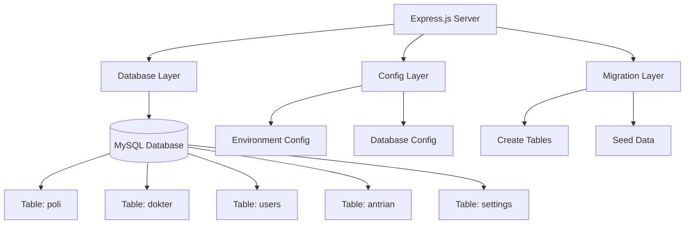
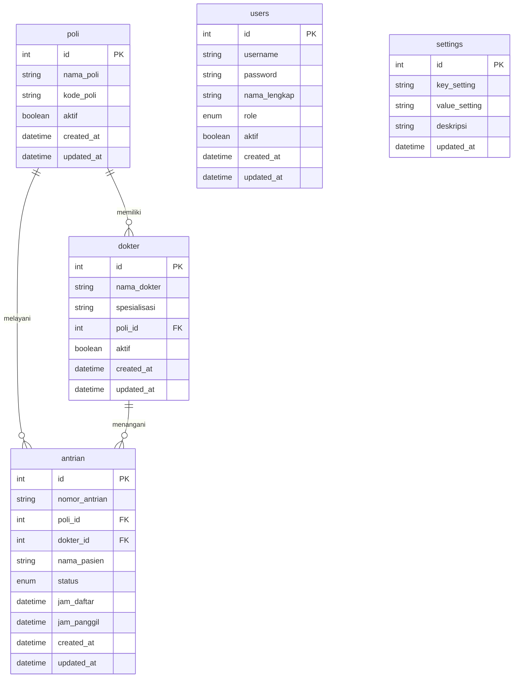

# Rencana Detail Milestone 1: Fondasi dan Arsitektur Backend

**Proyek**: Sistem Antrian RS v2.0  
**Milestone**: 1 - Fondasi dan Arsitektur Backend  
**Tanggal**: 15 Juni 2025  
**Database**: MySQL (user: root, password: kosong)  

## 📋 Overview Milestone 1

Milestone ini bertujuan membangun tulang punggung sistem yang kuat dan menyiapkan semua kebutuhan dasar server dan database untuk sistem antrian rumah sakit.

## 🎯 Tujuan Utama

1. **Penyiapan Lingkungan Server** - Konfigurasi komputer server untuk menjalankan aplikasi
2. **Desain dan Inisialisasi Database** - Merancang struktur tabel database sesuai kebutuhan

## 📝 Rencana Implementasi

### **Fase 1: Penyiapan Lingkungan Server (Tugas 1.1)**

#### 1.1.1 Inisialisasi Proyek Node.js
- [x] Membuat struktur direktori proyek
- [x] Inisialisasi `package.json` dengan dependencies yang diperlukan
- [x] Setup konfigurasi dasar Express.js
- [x] Konfigurasi environment variables

#### 1.1.2 Setup Development Tools
- [x] Konfigurasi Git dengan `.gitignore` yang sesuai
- [x] Setup Nodemon untuk development
- [x] Konfigurasi ESLint dan Prettier (opsional)
- [x] Setup struktur folder yang terorganisir

### **Fase 2: Desain dan Implementasi Database (Tugas 1.2)**

#### 1.2.1 Desain Skema Database
- [x] Analisis requirement untuk tabel: `poli`, `dokter`, `users`, `antrian`, `settings`
- [x] Desain relasi antar tabel dengan Foreign Key
- [x] Pembuatan ER Diagram

#### 1.2.2 Implementasi Database
- [x] Setup koneksi MySQL dengan user root tanpa password
- [x] Pembuatan migration scripts untuk setiap tabel
- [x] Implementasi seed data untuk testing
- [x] Testing koneksi database

## 🏗️ Arsitektur Sistem



## 📊 Struktur Database



## 📁 Struktur Direktori Proyek

```
RSUD-Queue-System/
├── src/
│   ├── config/
│   │   ├── database.js
│   │   └── env.js
│   ├── migrations/
│   │   ├── 001_create_poli_table.js
│   │   ├── 002_create_dokter_table.js
│   │   ├── 003_create_users_table.js
│   │   ├── 004_create_antrian_table.js
│   │   └── 005_create_settings_table.js
│   ├── models/
│   │   └── (akan dibuat di milestone 2)
│   ├── routes/
│   │   └── (akan dibuat di milestone 2)
│   ├── controllers/
│   │   └── (akan dibuat di milestone 2)
│   └── app.js
├── tests/
│   └── database.test.js
├── .env
├── .gitignore
├── package.json
├── README.md
└── server.js
```

## 🔧 Dependencies yang Diperlukan

### Production Dependencies
```json
{
  "express": "^4.18.2",
  "mysql2": "^3.6.0",
  "dotenv": "^16.3.1",
  "cors": "^2.8.5"
}
```

### Development Dependencies
```json
{
  "nodemon": "^3.0.1"
}
```

## 📋 Detail Tabel Database

### 1. Tabel `poli`
- **Fungsi**: Menyimpan data poliklinik/ruang pelayanan
- **Fields**:
  - `id` (INT, PK, AUTO_INCREMENT)
  - `nama_poli` (VARCHAR(100), NOT NULL)
  - `kode_poli` (VARCHAR(10), UNIQUE, NOT NULL)
  - `aktif` (BOOLEAN, DEFAULT TRUE)
  - `created_at` (TIMESTAMP, DEFAULT CURRENT_TIMESTAMP)
  - `updated_at` (TIMESTAMP, DEFAULT CURRENT_TIMESTAMP ON UPDATE CURRENT_TIMESTAMP)

### 2. Tabel `dokter`
- **Fungsi**: Menyimpan data dokter
- **Fields**:
  - `id` (INT, PK, AUTO_INCREMENT)
  - `nama_dokter` (VARCHAR(100), NOT NULL)
  - `spesialisasi` (VARCHAR(100))
  - `poli_id` (INT, FK ke poli.id)
  - `aktif` (BOOLEAN, DEFAULT TRUE)
  - `created_at` (TIMESTAMP, DEFAULT CURRENT_TIMESTAMP)
  - `updated_at` (TIMESTAMP, DEFAULT CURRENT_TIMESTAMP ON UPDATE CURRENT_TIMESTAMP)

### 3. Tabel `users`
- **Fungsi**: Menyimpan data pengguna sistem (admin, petugas)
- **Fields**:
  - `id` (INT, PK, AUTO_INCREMENT)
  - `username` (VARCHAR(50), UNIQUE, NOT NULL)
  - `password` (VARCHAR(255), NOT NULL)
  - `nama_lengkap` (VARCHAR(100), NOT NULL)
  - `role` (ENUM('admin', 'petugas'), NOT NULL)
  - `aktif` (BOOLEAN, DEFAULT TRUE)
  - `created_at` (TIMESTAMP, DEFAULT CURRENT_TIMESTAMP)
  - `updated_at` (TIMESTAMP, DEFAULT CURRENT_TIMESTAMP ON UPDATE CURRENT_TIMESTAMP)

### 4. Tabel `antrian`
- **Fungsi**: Menyimpan data antrian pasien
- **Fields**:
  - `id` (INT, PK, AUTO_INCREMENT)
  - `nomor_antrian` (VARCHAR(20), NOT NULL)
  - `poli_id` (INT, FK ke poli.id)
  - `dokter_id` (INT, FK ke dokter.id)
  - `nama_pasien` (VARCHAR(100))
  - `status` (ENUM('menunggu', 'dipanggil', 'selesai', 'terlewat'), DEFAULT 'menunggu')
  - `jam_daftar` (TIMESTAMP, DEFAULT CURRENT_TIMESTAMP)
  - `jam_panggil` (TIMESTAMP, NULL)
  - `created_at` (TIMESTAMP, DEFAULT CURRENT_TIMESTAMP)
  - `updated_at` (TIMESTAMP, DEFAULT CURRENT_TIMESTAMP ON UPDATE CURRENT_TIMESTAMP)

### 5. Tabel `settings`
- **Fungsi**: Menyimpan pengaturan sistem
- **Fields**:
  - `id` (INT, PK, AUTO_INCREMENT)
  - `key_setting` (VARCHAR(100), UNIQUE, NOT NULL)
  - `value_setting` (TEXT)
  - `deskripsi` (VARCHAR(255))
  - `updated_at` (TIMESTAMP, DEFAULT CURRENT_TIMESTAMP ON UPDATE CURRENT_TIMESTAMP)

## ✅ Kriteria Keberhasilan Milestone 1

### Server Requirements
- [x] Node.js server dapat berjalan di port yang ditentukan
- [x] Express.js berhasil dikonfigurasi dan merespons request dasar
- [x] Environment variables berhasil dimuat

### Database Requirements
- [x] Koneksi MySQL berhasil dengan user root tanpa password
- [x] Semua tabel berhasil dibuat sesuai skema
- [x] Migration scripts dapat dijalankan berulang kali
- [x] Seed data berhasil dimasukkan ke database

### Testing Requirements
- [x] Test koneksi database berhasil
- [x] Test pembuatan dan penghapusan tabel berhasil
- [x] Server dapat dijalankan tanpa error

## 🚀 Langkah Implementasi

1. **Setup Proyek**: Inisialisasi Node.js project dan install dependencies
2. **Konfigurasi Database**: Setup MySQL connection dan environment config
3. **Migrasi Database**: Buat dan jalankan migration scripts
4. **Testing**: Verifikasi semua komponen berfungsi dengan baik
5. **Dokumentasi**: Update README dengan instruksi setup dan penggunaan

## 📝 Catatan Implementasi

- Database menggunakan MySQL dengan user `root` tanpa password
- Environment development lokal
- Semua migration scripts harus bisa dijalankan berulang kali (idempotent)
- Struktur direktori mengikuti best practices Node.js
- Konfigurasi database dan environment dalam file terpisah untuk keamanan

## 🔄 Langkah Selanjutnya

Setelah Milestone 1 selesai, proyek akan dilanjutkan ke:
- **Milestone 2**: Otak Sistem - API dan Logika Inti
  - Pembuatan Endpoint API (CRUD)
  - Implementasi Server Komunikasi Real-time
  - Logika Autentikasi dan Manajemen Sesi

---

**Status**: Siap untuk implementasi  
**Mode Selanjutnya**: Code Mode  
**Estimasi Waktu**: 2-3 hari kerja