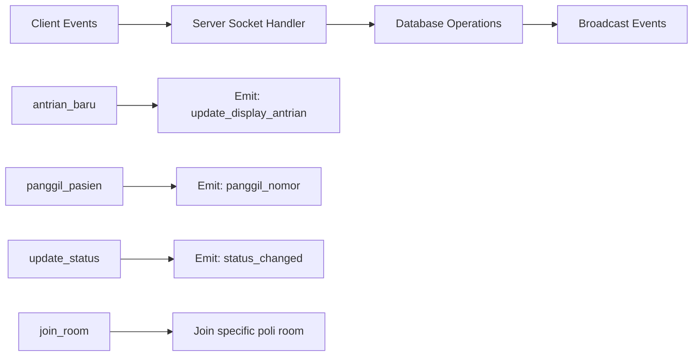
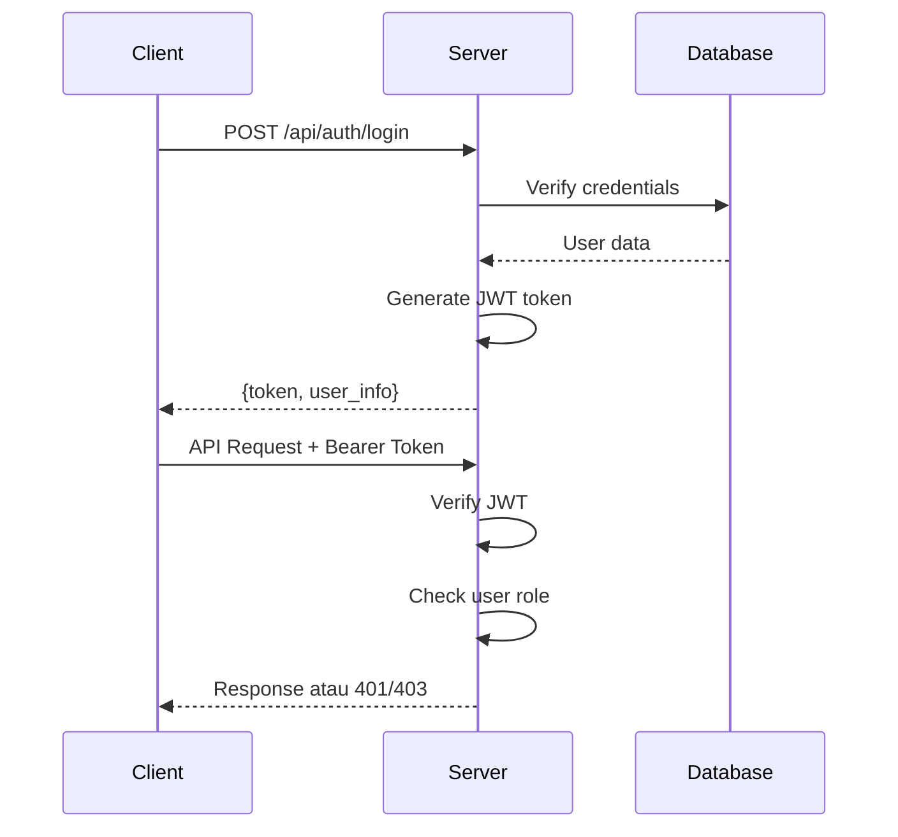

# Rencana Detail Milestone 2: Otak Sistem - API dan Logika Inti

**Proyek**: Sistem Antrian RS v2.0  
**Milestone**: 2 - API dan Logika Inti  
**Status**: 📋 **PERENCANAAN**  
**Estimasi Durasi**: 14 hari kerja  
**Target Mulai**: 16 Juni 2025  
**Target Selesai**: 5 Juli 2025  

## 🎯 Tujuan Milestone 2

Membangun layanan backend yang akan menjadi otak dari semua operasi, dari manajemen data hingga komunikasi real-time. Milestone ini akan mengimplementasikan:

1. **REST API lengkap** untuk semua operasi CRUD
2. **Sistem Real-time Communication** dengan WebSocket
3. **Sistem Autentikasi dan Otorisasi** yang aman

## 📋 Breakdown Tugas

### **Tugas 2.1: Pembuatan Endpoint API (CRUD)**
**Durasi**: 6-7 hari kerja  
**Priority**: HIGH  

#### Dependencies Baru yang Diperlukan:
```json
{
  "joi": "^17.9.2",
  "helmet": "^7.0.0",
  "express-rate-limit": "^6.8.1",
  "bcryptjs": "^2.4.3",
  "jsonwebtoken": "^9.0.1",
  "express-validator": "^7.0.1"
}
```

#### Struktur API Endpoints:

```mermaid
graph TB
    A[API Base: /api] --> B[/auth]
    A --> C[/poli]
    A --> D[/dokter]
    A --> E[/users]
    A --> F[/antrian]
    A --> G[/settings]
    
    B --> B1[POST /login]
    B --> B2[POST /logout]
    B --> B3[GET /profile]
    B --> B4[PUT /change-password]
    
    C --> C1[GET / - List all poli]
    C --> C2[GET /:id - Get poli by ID]
    C --> C3[POST / - Create poli]
    C --> C4[PUT /:id - Update poli]
    C --> C5[DELETE /:id - Delete poli]
    
    D --> D1[GET / - List all dokter]
    D --> D2[GET /:id - Get dokter by ID]
    D --> D3[GET /poli/:poliId - Get dokter by poli]
    D --> D4[POST / - Create dokter]
    D --> D5[PUT /:id - Update dokter]
    D --> D6[DELETE /:id - Delete dokter]
    
    E --> E1[GET / - List users]
    E --> E2[GET /:id - Get user by ID]
    E --> E3[POST / - Create user]
    E --> E4[PUT /:id - Update user]
    E --> E5[DELETE /:id - Delete user]
    
    F --> F1[GET / - List antrian]
    F --> F2[GET /:id - Get antrian by ID]
    F --> F3[GET /poli/:poliId - Get antrian by poli]
    F --> F4[GET /dokter/:dokterId - Get antrian by dokter]
    F --> F5[POST / - Create antrian]
    F --> F6[PUT /:id/status - Update status]
    F --> F7[PUT /:id/panggil - Panggil pasien]
    
    G --> G1[GET / - Get all settings]
    G --> G2[GET /:key - Get setting by key]
    G --> G3[PUT /:key - Update setting]
```

#### Validasi dan Error Handling:

**Response Format Standard:**
```json
{
  "status": "success|error",
  "message": "Pesan deskriptif",
  "data": {}, // untuk success response
  "errors": [] // untuk error response
}
```

**HTTP Status Codes:**
- `200` - OK (GET, PUT berhasil)
- `201` - Created (POST berhasil)
- `400` - Bad Request (validasi gagal)
- `401` - Unauthorized (tidak login)
- `403` - Forbidden (tidak ada akses)
- `404` - Not Found (data tidak ditemukan)
- `409` - Conflict (data duplikat)
- `500` - Internal Server Error

### **Tugas 2.2: Implementasi Server Komunikasi Real-time**
**Durasi**: 3-4 hari kerja  
**Priority**: HIGH  

#### Dependencies:
```json
{
  "socket.io": "^4.7.1"
}
```

#### WebSocket Events Architecture:



#### Event Definitions:

**Client → Server Events:**
- `join_poli_room` - Join room untuk poli tertentu
- `leave_poli_room` - Leave room poli
- `create_antrian` - Buat antrian baru
- `panggil_pasien` - Panggil pasien berikutnya
- `update_status_antrian` - Update status antrian

**Server → Client Events:**
- `antrian_baru_pendaftaran` - Ada antrian baru
- `update_antrian_poli` - Update data antrian poli
- `panggil_pasien` - Panggilan pasien
- `status_antrian_changed` - Status antrian berubah
- `connection_status` - Status koneksi

#### Room Management:
- `poli_{poli_id}` - Room untuk setiap poli
- `display_{poli_id}` - Room untuk display poli
- `petugas_{user_id}` - Room untuk petugas

### **Tugas 2.3: Logika Autentikasi dan Manajemen Sesi**
**Durasi**: 3-4 hari kerja  
**Priority**: HIGH  

#### JWT Authentication Flow:



#### Security Features:
- Password hashing dengan bcrypt (salt rounds: 12)
- JWT dengan expiration time (24 jam)
- Rate limiting untuk login attempts
- Helmet.js untuk security headers
- Role-based access control (RBAC)

#### Middleware Chain:
```javascript
// Contoh middleware chain
app.use('/api/admin/*', auth, adminOnly);
app.use('/api/petugas/*', auth, petugasOrAdmin);
app.use('/api/public/*', rateLimiter);
```

## 🏗️ Struktur Folder Implementasi

```
src/
├── controllers/              # Business logic handlers
│   ├── authController.js    # Login, logout, profile
│   ├── poliController.js    # CRUD poli
│   ├── dokterController.js  # CRUD dokter
│   ├── userController.js    # CRUD users
│   ├── antrianController.js # CRUD antrian + logika antrian
│   └── settingsController.js # CRUD settings
├── routes/                  # API route definitions
│   ├── index.js            # Route aggregator
│   ├── authRoutes.js       # Auth endpoints
│   ├── poliRoutes.js       # Poli endpoints
│   ├── dokterRoutes.js     # Dokter endpoints
│   ├── userRoutes.js       # User endpoints
│   ├── antrianRoutes.js    # Antrian endpoints
│   └── settingsRoutes.js   # Settings endpoints
├── middleware/              # Custom middleware
│   ├── auth.js             # JWT verification
│   ├── rbac.js             # Role-based access control
│   ├── validation.js       # Input validation schemas
│   ├── errorHandler.js     # Global error handler
│   └── rateLimiter.js      # Rate limiting
├── models/                  # Database interaction layer
│   ├── BaseModel.js        # Base model with common methods
│   ├── Poli.js             # Poli model
│   ├── Dokter.js           # Dokter model
│   ├── User.js             # User model
│   ├── Antrian.js          # Antrian model
│   └── Settings.js         # Settings model
├── utils/                   # Utility functions
│   ├── jwt.js              # JWT utilities
│   ├── bcrypt.js           # Password utilities
│   ├── response.js         # Response formatter
│   └── logger.js           # Logging utility
├── sockets/                 # Socket.IO handlers
│   ├── antrianSocket.js    # Antrian-related events
│   ├── authSocket.js       # Authentication for sockets
│   └── index.js            # Socket server setup
└── validators/              # Input validation schemas
    ├── authValidator.js    # Auth input validation
    ├── poliValidator.js    # Poli input validation
    ├── dokterValidator.js  # Dokter input validation
    ├── userValidator.js    # User input validation
    └── antrianValidator.js # Antrian input validation
```

## 📅 Timeline Detail

### **Week 1 (16-20 Juni 2025)**

#### Hari 1 (Senin): Setup & Foundation
- [ ] Install dependencies baru
- [ ] Buat struktur folder lengkap
- [ ] Setup middleware dasar (helmet, cors, rate limiting)
- [ ] Implementasi global error handler
- [ ] Setup logging system

#### Hari 2 (Selasa): Database Models
- [ ] Implementasi BaseModel dengan common methods
- [ ] Buat model Poli dengan CRUD operations
- [ ] Buat model Dokter dengan CRUD operations
- [ ] Testing model connections

#### Hari 3 (Rabu): Authentication System
- [ ] Implementasi JWT utilities
- [ ] Buat authController (login, logout, profile)
- [ ] Implementasi password hashing
- [ ] Buat auth middleware dan RBAC
- [ ] Testing authentication

#### Hari 4 (Kamis): User & Settings API
- [ ] Implementasi User model dan controller
- [ ] Implementasi Settings model dan controller
- [ ] Buat validation schemas
- [ ] Testing User dan Settings endpoints

#### Hari 5 (Jumat): Antrian API Foundation
- [ ] Implementasi Antrian model
- [ ] Buat antrianController dasar
- [ ] Implementasi logika nomor antrian
- [ ] Testing basic antrian operations

### **Week 2 (23-27 Juni 2025)**

#### Hari 6 (Senin): Complete API Endpoints
- [ ] Finalisasi semua CRUD endpoints
- [ ] Implementasi advanced antrian logic
- [ ] Add comprehensive input validation
- [ ] API documentation update

#### Hari 7 (Selasa): Socket.IO Setup
- [ ] Setup Socket.IO server
- [ ] Implementasi room management
- [ ] Buat socket authentication
- [ ] Basic socket event handlers

#### Hari 8 (Rabu): Real-time Antrian Logic
- [ ] Implementasi antrian socket events
- [ ] Integrasi socket dengan API endpoints
- [ ] Real-time updates untuk display
- [ ] Testing socket functionality

#### Hari 9 (Kamis): Socket Integration
- [ ] Complete socket event implementation
- [ ] Error handling untuk socket connections
- [ ] Socket reconnection logic
- [ ] Cross-browser compatibility testing

#### Hari 10 (Jumat): Integration & Testing
- [ ] Integration testing semua komponen
- [ ] Performance testing
- [ ] Security testing
- [ ] Load testing dasar

### **Week 3 (30 Juni - 4 Juli 2025)**

#### Hari 11-12: Bug Fixes & Optimization
- [ ] Fix bugs dari testing
- [ ] Performance optimization
- [ ] Code review dan refactoring
- [ ] Documentation completion

#### Hari 13-14: Final Testing & Preparation
- [ ] End-to-end testing
- [ ] Prepare for Milestone 3
- [ ] Deployment preparation
- [ ] Handover documentation

## 🧪 Testing Strategy

### Unit Tests
```javascript
// Contoh test structure
describe('Poli Controller', () => {
  test('should create poli successfully', async () => {
    // Test implementation
  });
  
  test('should validate poli input', async () => {
    // Test validation
  });
});
```

### Integration Tests
- Database operations
- API endpoint responses
- Authentication flow
- Socket connections

### Performance Tests
- API response times (< 200ms)
- Concurrent socket connections (> 100)
- Database query optimization
- Memory usage monitoring

## 🔒 Security Considerations

### Input Validation
- Joi schemas untuk semua input
- SQL injection prevention
- XSS protection
- CSRF protection (untuk future frontend)

### Authentication Security
- Strong password requirements
- Login attempt rate limiting
- JWT token expiration
- Secure password storage (bcrypt)

### API Security
- Helmet.js security headers
- CORS configuration
- Rate limiting per IP
- Request size limiting

## 📊 Performance Targets

| Metric | Target | Measurement |
|--------|--------|-------------|
| API Response Time | < 200ms | Average response time |
| Database Query Time | < 50ms | Average query execution |
| Socket Connection | < 100ms | Connection establishment |
| Concurrent Users | > 100 | Simultaneous connections |
| Memory Usage | < 512MB | Peak memory consumption |
| CPU Usage | < 70% | Peak CPU utilization |

## 📋 Kriteria Selesai

### Tugas 2.1 - API CRUD
- [ ] Semua endpoint API berfungsi sesuai spesifikasi
- [ ] Input validation bekerja dengan baik
- [ ] Error handling konsisten di semua endpoint
- [ ] Authentication dan authorization berfungsi
- [ ] API dapat diuji dengan Postman/Insomnia
- [ ] Response time memenuhi target performance

### Tugas 2.2 - Real-time Communication
- [ ] Socket.IO server berjalan tanpa error
- [ ] Semua event handler berfungsi dengan baik
- [ ] Room management bekerja untuk multiple poli
- [ ] Real-time updates sampai ke client
- [ ] Reconnection logic berfungsi
- [ ] Error handling untuk socket connections

### Tugas 2.3 - Authentication System
- [ ] User dapat login dan logout
- [ ] JWT token validation berfungsi
- [ ] Role-based access control bekerja
- [ ] Password hashing aman
- [ ] Rate limiting untuk login attempts
- [ ] Security headers terpasang

### General Requirements
- [ ] Semua code mengikuti coding standards
- [ ] Documentation lengkap dan up-to-date
- [ ] No critical security vulnerabilities
- [ ] Performance targets tercapai
- [ ] Integration testing 100% pass
- [ ] Ready for Milestone 3 development

## 🔄 Dependencies untuk Milestone 3

Milestone 2 akan menyediakan foundation untuk Milestone 3:
- REST API yang stabil untuk frontend consumption
- Real-time communication infrastructure
- Secure authentication system
- Database models dan business logic

## 📚 Documentation Deliverables

1. **API Documentation** - Endpoint specifications
2. **Socket Events Documentation** - Real-time event specifications
3. **Security Guide** - Authentication dan authorization guide
4. **Deployment Guide** - Setup dan konfigurasi guide
5. **Testing Report** - Test results dan coverage

## 🎯 Success Metrics

- [ ] 100% API endpoint functionality
- [ ] 100% real-time event reliability
- [ ] Zero critical security vulnerabilities
- [ ] < 200ms average API response time
- [ ] > 99% uptime selama testing period
- [ ] Complete documentation coverage

---

**Prepared by**: Development Team  
**Date**: 15 Juni 2025  
**Version**: 2.0.0  
**Status**: Ready for Implementation 🚀