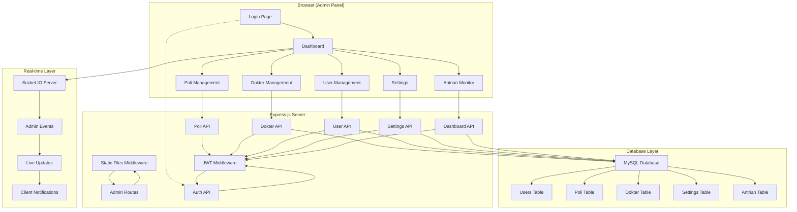

# Milestone 3 Plan: Panel Admin

**Proyek**: Sistem Antrian RS v2.0  
**Milestone**: 3 - Modul Inti Panel Admin  
**Tujuan**: Membangun antarmuka yang lengkap bagi Admin untuk mengelola seluruh sistem  
**Estimasi Waktu**: 10-13 hari kerja  
**Dependencies**: Milestone 2 (API Foundation) - ✅ SELESAI  

---

## 🎯 Tujuan Utama

Membangun Panel Admin yang lengkap dan terintegrasi dengan backend untuk mengelola seluruh sistem antrian rumah sakit, termasuk:

- Manajemen Poli, Dokter, dan User
- Dashboard analytics dan monitoring
- Pengaturan sistem (Settings)
- Real-time updates dan notifications
- Interface yang user-friendly dan responsive

---

## 📊 Gap Analysis dari Milestone 2

### ✅ Yang Sudah Tersedia (Milestone 2):
- ✅ Authentication API lengkap (`/api/auth/*`)
- ✅ Poli Management API lengkap (`/api/poli/*`)
- ✅ JWT Authentication & Authorization system
- ✅ Input validation & error handling
- ✅ Rate limiting & security middleware
- ✅ Base Model dengan CRUD operations
- ✅ User Model & Poli Model
- ✅ Database structure lengkap

### ⚠️ Yang Perlu Ditambahkan:
- ❌ Dokter Management API (Model, Controller, Routes, Validator)
- ❌ Enhanced User Management API (untuk admin mengelola user lain)
- ❌ Settings Management API (konfigurasi sistem)
- ❌ Dashboard Analytics API (statistik dan monitoring)
- ❌ Frontend Panel Admin (HTML, CSS, JS)
- ❌ Socket.IO Real-time implementation
- ❌ Static file serving configuration

---

## 🏗️ Arsitektur Sistem



---

## 🚀 Implementation Plan

## Phase 1: Backend API Completion (2-3 hari)

### Task 3.1.1: Dokter Management API

**Files to Create/Modify:**
- `src/models/Dokter.js` - Dokter model dengan relasi
- `src/validators/dokterValidator.js` - Input validation schemas
- `src/controllers/dokterController.js` - Business logic
- `src/routes/dokterRoutes.js` - RESTful endpoints
- `src/routes/index.js` - Add dokter routes

**API Endpoints:**
```javascript
// Dokter Management Endpoints
GET    /api/dokter              // List dokter (with filters)
POST   /api/dokter              // Create dokter (Admin only)
GET    /api/dokter/:id          // Get dokter detail
PUT    /api/dokter/:id          // Update dokter (Admin only)
DELETE /api/dokter/:id          // Delete dokter (Admin only)
GET    /api/dokter/by-poli/:poliId    // Dokter by poli
GET    /api/dokter/active       // Active dokter only
GET    /api/dokter/search       // Search dokter
PATCH  /api/dokter/:id/toggle-status  // Toggle active status
```

**Dokter Model Schema:**
```javascript
{
  id: INT PRIMARY KEY,
  nama_dokter: VARCHAR(100) NOT NULL,
  spesialisasi: VARCHAR(100),
  poli_id: INT (FK to poli.id),
  aktif: BOOLEAN DEFAULT TRUE,
  created_at: TIMESTAMP,
  updated_at: TIMESTAMP
}
```

**Business Logic Features:**
- ✅ Validation nama_dokter (required, 3-100 chars)
- ✅ Validation spesialisasi (optional, max 100 chars)
- ✅ Validation poli_id (must exist in poli table)
- ✅ Soft delete handling
- ✅ Search by name and specialization
- ✅ Filter by poli_id and aktif status
- ✅ Check dependencies before delete

### Task 3.1.2: Enhanced User Management API

**Files to Create/Modify:**
- `src/controllers/userController.js` - User CRUD untuk admin
- `src/routes/userRoutes.js` - User management routes
- `src/validators/userValidator.js` - User validation schemas
- `src/routes/index.js` - Add user routes

**API Endpoints:**
```javascript
// User Management Endpoints (Admin Only)
GET    /api/users              // List all users
POST   /api/users              // Create user
GET    /api/users/:id          // Get user detail
PUT    /api/users/:id          // Update user
DELETE /api/users/:id          // Delete user
GET    /api/users/by-role/:role     // Users by role
PATCH  /api/users/:id/toggle-status // Toggle user status
PATCH  /api/users/:id/reset-password // Reset user password
```

**Enhanced User Features:**
- ✅ Admin can create/edit/delete other users
- ✅ Role-based filtering (admin/petugas)
- ✅ Password reset functionality
- ✅ Account status management
- ✅ User activity tracking
- ✅ Bulk operations support

### Task 3.1.3: Settings Management API

**Files to Create:**
- `src/models/Settings.js` - Settings model
- `src/validators/settingsValidator.js` - Settings validation
- `src/controllers/settingsController.js` - Settings CRUD
- `src/routes/settingsRoutes.js` - Settings endpoints

**API Endpoints:**
```javascript
// Settings Management Endpoints
GET    /api/settings           // Get all settings
GET    /api/settings/:key      // Get setting by key
PUT    /api/settings/:key      // Update setting value
POST   /api/settings/batch     // Batch update settings
GET    /api/settings/categories // Get settings by category
```

**Settings Categories:**
```javascript
// Predefined Settings Categories
const SETTINGS_CATEGORIES = {
  GENERAL: {
    'app_name': 'RSUD Queue System',
    'app_version': '2.0.0',
    'timezone': 'Asia/Jakarta'
  },
  QUEUE: {
    'max_queue_per_day': 100,
    'auto_reset_queue': true,
    'queue_start_time': '08:00',
    'queue_end_time': '16:00'
  },
  DISPLAY: {
    'display_theme': 'blue',
    'show_doctor_name': true,
    'refresh_interval': 5000,
    'sound_enabled': true
  },
  KIOSK: {
    'kiosk_enabled': true,
    'self_registration': true,
    'print_ticket': true,
    'max_queue_per_poli': 50
  }
};
```

### Task 3.1.4: Dashboard Analytics API

**Files to Create:**
- `src/controllers/dashboardController.js` - Dashboard data aggregation
- `src/routes/dashboardRoutes.js` - Dashboard endpoints

**API Endpoints:**
```javascript
// Dashboard Analytics Endpoints
GET    /api/dashboard/stats           // General statistics
GET    /api/dashboard/antrian-today  // Today's queue stats
GET    /api/dashboard/antrian-week   // This week's stats
GET    /api/dashboard/activity-log   // Recent activities
GET    /api/dashboard/alerts         // System alerts
GET    /api/dashboard/performance    // System performance metrics
```

**Dashboard Data Structure:**
```javascript
// Dashboard Stats Response
{
  totalPoli: 5,
  totalDokter: 12,
  totalUsers: 8,
  antrianHariIni: 45,
  antrianMenunggu: 12,
  antrianSelesai: 33,
  antrianTerlewat: 0,
  systemStatus: 'healthy',
  lastUpdated: '2025-06-15T10:30:00.000Z'
}
```

---

## Phase 2: Frontend Structure Setup (1 hari)

### Task 3.2.1: Directory Structure

**Create Directory Structure:**
```
public/
├── admin/
│   ├── index.html              # Login page
│   ├── dashboard.html          # Main dashboard
│   ├── poli.html              # Poli management
│   ├── dokter.html            # Dokter management
│   ├── users.html             # User management
│   ├── settings.html          # Settings management
│   ├── css/
│   │   ├── admin.css          # Main admin styles
│   │   ├── components.css     # Reusable components
│   │   ├── responsive.css     # Mobile responsive
│   │   └── themes.css         # Color themes
│   ├── js/
│   │   ├── admin.js           # Main admin logic
│   │   ├── auth.js            # Authentication handling
│   │   ├── api.js             # API communication
│   │   ├── components.js      # UI components
│   │   ├── utils.js           # Utility functions
│   │   └── config.js          # Configuration
│   └── assets/
│       ├── icons/             # UI icons (SVG)
│       ├── images/            # Images/logos
│       └── fonts/             # Custom fonts (optional)
```

### Task 3.2.2: Express Static Configuration

**Update `src/app.js`:**
```javascript
// Static files middleware
app.use('/admin', express.static(path.join(__dirname, '../public/admin')));

// Admin routes (catch-all for SPA)
app.get('/admin/*', (req, res) => {
  res.sendFile(path.join(__dirname, '../public/admin/index.html'));
});
```

---

## Phase 3: Frontend Implementation (4-5 hari)

### Task 3.3.1: Authentication UI

**Login Page (`public/admin/index.html`):**
```html
<!DOCTYPE html>
<html lang="id">
<head>
    <meta charset="UTF-8">
    <meta name="viewport" content="width=device-width, initial-scale=1.0">
    <title>RSUD Queue System - Admin Login</title>
    <link rel="stylesheet" href="css/admin.css">
</head>
<body class="login-page">
    <div class="login-container">
        <div class="login-card">
            <div class="login-header">
                <h1>RSUD Queue System</h1>
                <p>Admin Panel v2.0</p>
            </div>
            <form id="loginForm" class="login-form">
                <div class="form-group">
                    <label for="username">Username</label>
                    <input type="text" id="username" name="username" required>
                </div>
                <div class="form-group">
                    <label for="password">Password</label>
                    <input type="password" id="password" name="password" required>
                </div>
                <div class="form-group">
                    <label class="checkbox-label">
                        <input type="checkbox" id="remember" name="remember">
                        <span class="checkmark"></span>
                        Remember me
                    </label>
                </div>
                <button type="submit" class="btn-login">
                    <span class="btn-text">Login</span>
                    <span class="btn-loader hidden">Loading...</span>
                </button>
            </form>
            <div id="errorMessage" class="error-message hidden"></div>
        </div>
    </div>
    <script src="js/auth.js"></script>
</body>
</html>
```

**Authentication Features:**
- ✅ Username/password validation
- ✅ Remember me functionality
- ✅ Loading states
- ✅ Error messaging
- ✅ Auto-redirect jika sudah login
- ✅ Token refresh handling

### Task 3.3.2: Dashboard UI

**Main Dashboard Layout:**
```html
<!-- Sidebar Navigation -->
<nav class="sidebar">
    <div class="sidebar-header">
        <h2>RSUD Admin</h2>
    </div>
    <ul class="sidebar-menu">
        <li><a href="dashboard.html" class="active">Dashboard</a></li>
        <li><a href="poli.html">Poli Management</a></li>
        <li><a href="dokter.html">Dokter Management</a></li>
        <li><a href="users.html">User Management</a></li>
        <li><a href="settings.html">Settings</a></li>
    </ul>
</nav>

<!-- Main Content -->
<main class="main-content">
    <header class="content-header">
        <h1>Dashboard</h1>
        <div class="user-info">
            <span id="currentUser">Loading...</span>
            <button id="logoutBtn">Logout</button>
        </div>
    </header>
    
    <!-- Statistics Cards -->
    <div class="stats-grid">
        <div class="stat-card">
            <h3>Total Poli</h3>
            <div class="stat-value" id="totalPoli">-</div>
        </div>
        <div class="stat-card">
            <h3>Total Dokter</h3>
            <div class="stat-value" id="totalDokter">-</div>
        </div>
        <div class="stat-card">
            <h3>Antrian Hari Ini</h3>
            <div class="stat-value" id="antrianHariIni">-</div>
        </div>
        <div class="stat-card">
            <h3>Active Users</h3>
            <div class="stat-value" id="activeUsers">-</div>
        </div>
    </div>
    
    <!-- Recent Activity -->
    <div class="activity-section">
        <h2>Recent Activity</h2>
        <div id="activityFeed" class="activity-feed">
            <!-- Dynamic content -->
        </div>
    </div>
</main>
```

### Task 3.3.3: Management Pages

**Poli Management Features:**
- ✅ Paginated data table
- ✅ Search & filter functionality
- ✅ Add/Edit modal forms
- ✅ Delete confirmation dialogs
- ✅ Status toggle buttons
- ✅ Bulk operations
- ✅ Export functionality

**Dokter Management Features:**
- ✅ Dokter list dengan poli association
- ✅ Filter by poli
- ✅ Add/Edit forms dengan poli selection
- ✅ Specialization management
- ✅ Status management

**User Management Features:**
- ✅ User list dengan role filters
- ✅ Create user dengan role selection
- ✅ Password reset functionality
- ✅ Account status toggle
- ✅ Activity tracking

**Settings Management Features:**
- ✅ Categorized settings display
- ✅ Real-time preview
- ✅ Validation per setting type
- ✅ Bulk save functionality
- ✅ Reset to defaults

### Task 3.3.4: JavaScript Architecture

**Core JavaScript Structure:**

**`config.js` - Configuration:**
```javascript
const CONFIG = {
    API_BASE_URL: '/api',
    TOKEN_KEY: 'admin_token',
    REFRESH_TOKEN_KEY: 'admin_refresh_token',
    SOCKET_URL: window.location.origin,
    PAGE_SIZE: 10,
    DEBOUNCE_DELAY: 300
};
```

**`api.js` - API Communication:**
```javascript
class AdminAPI {
    constructor() {
        this.baseURL = CONFIG.API_BASE_URL;
        this.token = localStorage.getItem(CONFIG.TOKEN_KEY);
    }
    
    // Generic API methods
    async get(endpoint, params = {}) { /* ... */ }
    async post(endpoint, data) { /* ... */ }
    async put(endpoint, data) { /* ... */ }
    async delete(endpoint) { /* ... */ }
    
    // Authentication
    async login(credentials) { /* ... */ }
    async logout() { /* ... */ }
    
    // Poli methods
    async getPoli(params) { /* ... */ }
    async createPoli(data) { /* ... */ }
    
    // Dokter methods
    async getDokter(params) { /* ... */ }
    async createDokter(data) { /* ... */ }
    
    // User methods
    async getUsers(params) { /* ... */ }
    async createUser(data) { /* ... */ }
    
    // Settings methods
    async getSettings() { /* ... */ }
    async updateSettings(data) { /* ... */ }
    
    // Dashboard methods
    async getDashboardStats() { /* ... */ }
}
```

**`components.js` - Reusable Components:**
```javascript
class AdminComponents {
    // Modal component
    static createModal(title, content, actions) { /* ... */ }
    
    // Data table component
    static createDataTable(data, columns, actions) { /* ... */ }
    
    // Form component
    static createForm(fields, onSubmit) { /* ... */ }
    
    // Pagination component
    static createPagination(currentPage, totalPages, onPageChange) { /* ... */ }
    
    // Alert/notification component
    static showAlert(message, type) { /* ... */ }
    
    // Loading component
    static showLoading(element) { /* ... */ }
    static hideLoading(element) { /* ... */ }
}
```

---

## Phase 4: Real-time Integration (2 hari)

### Task 3.4.1: Socket.IO Server Implementation

**Create `src/sockets/index.js`:**
```javascript
const socketAuth = require('./middleware/socketAuth');
const adminNamespace = require('./namespaces/admin');
const displayNamespace = require('./namespaces/display');

function initializeSocket(io) {
    // Admin namespace
    const adminIO = io.of('/admin');
    adminIO.use(socketAuth);
    adminIO.on('connection', adminNamespace);
    
    // Display namespace
    const displayIO = io.of('/display');
    displayIO.on('connection', displayNamespace);
    
    return { adminIO, displayIO };
}

module.exports = initializeSocket;
```

**Admin Socket Events:**
```javascript
// Admin namespace events
const adminEvents = {
    // Dashboard updates
    'dashboard:subscribe': 'Subscribe to dashboard updates',
    'dashboard:stats': 'Real-time statistics',
    
    // Antrian updates
    'antrian:new': 'New queue created',
    'antrian:called': 'Queue called',
    'antrian:completed': 'Queue completed',
    
    // System alerts
    'system:alert': 'System alerts',
    'system:maintenance': 'Maintenance notifications',
    
    // User activity
    'user:login': 'User login activity',
    'user:logout': 'User logout activity'
};
```

### Task 3.4.2: Socket.IO Client Integration

**Frontend Socket Implementation:**
```javascript
class AdminSocket {
    constructor() {
        this.socket = io('/admin', {
            auth: {
                token: localStorage.getItem(CONFIG.TOKEN_KEY)
            }
        });
        
        this.setupEventListeners();
    }
    
    setupEventListeners() {
        // Dashboard updates
        this.socket.on('dashboard:stats', this.updateDashboardStats);
        
        // Antrian updates
        this.socket.on('antrian:new', this.handleNewAntrian);
        this.socket.on('antrian:called', this.handleAntrianCalled);
        
        // System alerts
        this.socket.on('system:alert', this.showSystemAlert);
        
        // Connection status
        this.socket.on('connect', this.handleConnect);
        this.socket.on('disconnect', this.handleDisconnect);
    }
    
    // Event handlers
    updateDashboardStats(data) { /* ... */ }
    handleNewAntrian(data) { /* ... */ }
    showSystemAlert(alert) { /* ... */ }
}
```

---

## Phase 5: UI/UX Polish & Testing (1-2 hari)

### Task 3.5.1: UI/UX Enhancement

**Design System Implementation:**

**Color Palette:**
```css
:root {
    --primary-color: #2563eb;
    --primary-dark: #1e40af;
    --secondary-color: #64748b;
    --success-color: #10b981;
    --warning-color: #f59e0b;
    --error-color: #ef4444;
    --background-color: #f8fafc;
    --surface-color: #ffffff;
    --text-primary: #1e293b;
    --text-secondary: #64748b;
    --border-color: #e2e8f0;
}
```

**Typography:**
```css
.font-heading {
    font-family: 'Inter', -apple-system, BlinkMacSystemFont, sans-serif;
    font-weight: 600;
}

.font-body {
    font-family: 'Inter', -apple-system, BlinkMacSystemFont, sans-serif;
    font-weight: 400;
}
```

**Component Styles:**
```css
/* Button styles */
.btn {
    padding: 0.5rem 1rem;
    border-radius: 0.375rem;
    font-weight: 500;
    transition: all 0.2s;
}

.btn-primary {
    background: var(--primary-color);
    color: white;
}

.btn-primary:hover {
    background: var(--primary-dark);
}

/* Card styles */
.card {
    background: var(--surface-color);
    border-radius: 0.5rem;
    box-shadow: 0 1px 3px rgba(0, 0, 0, 0.1);
    padding: 1.5rem;
}

/* Table styles */
.data-table {
    width: 100%;
    border-collapse: collapse;
}

.data-table th,
.data-table td {
    padding: 0.75rem;
    text-align: left;
    border-bottom: 1px solid var(--border-color);
}
```

**Responsive Design:**
```css
/* Mobile-first approach */
@media (min-width: 768px) {
    .sidebar {
        display: block;
    }
    
    .main-content {
        margin-left: 250px;
    }
}

@media (max-width: 767px) {
    .sidebar {
        transform: translateX(-100%);
        transition: transform 0.3s;
    }
    
    .sidebar.active {
        transform: translateX(0);
    }
    
    .stats-grid {
        grid-template-columns: 1fr;
    }
}
```

### Task 3.5.2: Testing & Quality Assurance

**Testing Checklist:**

**Functionality Testing:**
- [ ] Login/logout flow
- [ ] All CRUD operations (Create, Read, Update, Delete)
- [ ] Search and filter functionality
- [ ] Pagination
- [ ] Form validation
- [ ] Error handling
- [ ] Real-time updates

**Cross-browser Testing:**
- [ ] Chrome (latest)
- [ ] Firefox (latest)
- [ ] Safari (latest)
- [ ] Edge (latest)

**Device Testing:**
- [ ] Desktop (1920x1080, 1366x768)
- [ ] Tablet (768x1024, 1024x768)
- [ ] Mobile (375x667, 414x896)

**Performance Testing:**
- [ ] Page load time < 2 seconds
- [ ] API response time < 500ms
- [ ] Memory usage optimization
- [ ] Network optimization

**Security Testing:**
- [ ] XSS prevention
- [ ] CSRF protection
- [ ] SQL injection prevention
- [ ] Authentication bypass attempts
- [ ] Authorization testing

---

## 📊 Success Criteria

### Functional Requirements:
- [ ] **100% CRUD Operations**: Semua Create, Read, Update, Delete berfungsi
- [ ] **Authentication**: Login/logout dengan JWT token
- [ ] **Authorization**: Role-based access control
- [ ] **Real-time Updates**: Dashboard dan notifications
- [ ] **Responsive Design**: Bekerja di desktop, tablet, mobile
- [ ] **Error Handling**: User-friendly error messages
- [ ] **Data Validation**: Client-side dan server-side validation

### Performance Requirements:
- [ ] **Page Load**: < 2 detik first load
- [ ] **API Response**: < 500ms average
- [ ] **Real-time Latency**: < 100ms socket updates
- [ ] **Memory Usage**: < 50MB browser memory
- [ ] **Network Efficiency**: Minimal API calls

### Security Requirements:
- [ ] **Zero Critical Vulnerabilities**: Security scan clean
- [ ] **Input Validation**: Semua input ter-validate
- [ ] **Authorization**: Proper access control
- [ ] **Session Management**: Secure token handling
- [ ] **HTTPS Ready**: Production-ready security

### Usability Requirements:
- [ ] **Task Completion**: Admin dapat complete task ≤ 3 clicks
- [ ] **Navigation**: Intuitive menu dan breadcrumbs
- [ ] **Feedback**: Loading states dan success/error messages
- [ ] **Accessibility**: Basic WCAG compliance
- [ ] **Mobile Friendly**: Touch-friendly interface

---

## 🚀 Deliverables

### 1. Backend APIs
- [ ] Dokter Management API (complete CRUD)
- [ ] Enhanced User Management API
- [ ] Settings Management API
- [ ] Dashboard Analytics API
- [ ] Socket.IO real-time server

### 2. Frontend Panel Admin
- [ ] Login page dengan authentication
- [ ] Dashboard dengan real-time stats
- [ ] Poli management interface
- [ ] Dokter management interface
- [ ] User management interface
- [ ] Settings management interface

### 3. Documentation
- [ ] API documentation update
- [ ] User manual untuk admin
- [ ] Technical documentation
- [ ] Deployment guide
- [ ] Testing results

### 4. Testing & Quality
- [ ] Unit tests untuk new APIs
- [ ] Integration tests
- [ ] Frontend testing results
- [ ] Security testing report
- [ ] Performance testing report

---

## ⏱️ Timeline & Milestones

| Phase | Duration | Start Date | End Date | Deliverables |
|-------|----------|------------|----------|--------------|
| **Phase 1**: Backend APIs | 3 hari | Hari 1 | Hari 3 | Dokter, User, Settings, Dashboard APIs |
| **Phase 2**: Frontend Setup | 1 hari | Hari 4 | Hari 4 | Directory structure, static config |
| **Phase 3**: Frontend Implementation | 5 hari | Hari 5 | Hari 9 | All admin pages, authentication |
| **Phase 4**: Real-time Integration | 2 hari | Hari 10 | Hari 11 | Socket.IO implementation |
| **Phase 5**: Polish & Testing | 2 hari | Hari 12 | Hari 13 | UI polish, testing, bug fixes |

### Daily Breakdown:

**Hari 1-2: Backend Foundation**
- Dokter Model, Controller, Routes, Validator
- Enhanced User Management API
- Testing API endpoints

**Hari 3: Backend Completion**
- Settings Management API
- Dashboard Analytics API
- API integration testing

**Hari 4: Frontend Structure**
- Directory structure setup
- Static file configuration
- Base HTML templates

**Hari 5-6: Authentication & Dashboard**
- Login page implementation
- Authentication flow
- Dashboard layout dan functionality

**Hari 7-8: Management Pages**
- Poli, Dokter, User management pages
- CRUD operations frontend
- Form validation

**Hari 9: Settings & Polish**
- Settings management page
- UI/UX improvements
- Responsive design

**Hari 10-11: Real-time Features**
- Socket.IO server implementation
- Frontend socket integration
- Real-time dashboard updates

**Hari 12-13: Testing & Final**
- Cross-browser testing
- Mobile testing
- Bug fixes dan optimization

---

## 🎯 Risk Mitigation

### Technical Risks:
- **Risk**: Complex frontend integration
  - **Mitigation**: Incremental development, thorough testing setiap component

- **Risk**: Real-time performance issues
  - **Mitigation**: Proper socket connection management, rate limiting

- **Risk**: Security vulnerabilities
  - **Mitigation**: Security review, input validation, authorization checks

### Timeline Risks:
- **Risk**: Backend API delays
  - **Mitigation**: Parallel development, mock APIs untuk frontend

- **Risk**: Frontend complexity underestimated
  - **Mitigation**: Simplify UI jika diperlukan, focus on core functionality

### Quality Risks:
- **Risk**: Poor user experience
  - **Mitigation**: User testing, iterative improvements

- **Risk**: Browser compatibility issues
  - **Mitigation**: Progressive enhancement, polyfills

---

## 📈 Success Metrics

### Development Metrics:
- [ ] **API Coverage**: 100% endpoint implementation
- [ ] **Test Coverage**: >80% untuk new code
- [ ] **Code Quality**: No critical issues dalam code review
- [ ] **Documentation**: Complete API dan user documentation

### Performance Metrics:
- [ ] **Load Time**: <2s first page load
- [ ] **Responsiveness**: <100ms UI interactions
- [ ] **Reliability**: 99.9% uptime target
- [ ] **Scalability**: Handle 50+ concurrent admin users

### User Experience Metrics:
- [ ] **Task Success Rate**: 95% task completion
- [ ] **Error Rate**: <5% user errors
- [ ] **Learning Curve**: Admin dapat menguasai dalam <30 menit
- [ ] **Satisfaction**: Positive feedback dari test users

---

**Status**: 🚀 **READY TO START**  
**Dependencies**: Milestone 2 ✅ Complete  
**Next Steps**: Begin Phase 1 - Backend API Development  

---

*Plan ini akan diupdate seiring progress development dan feedback dari stakeholder.*