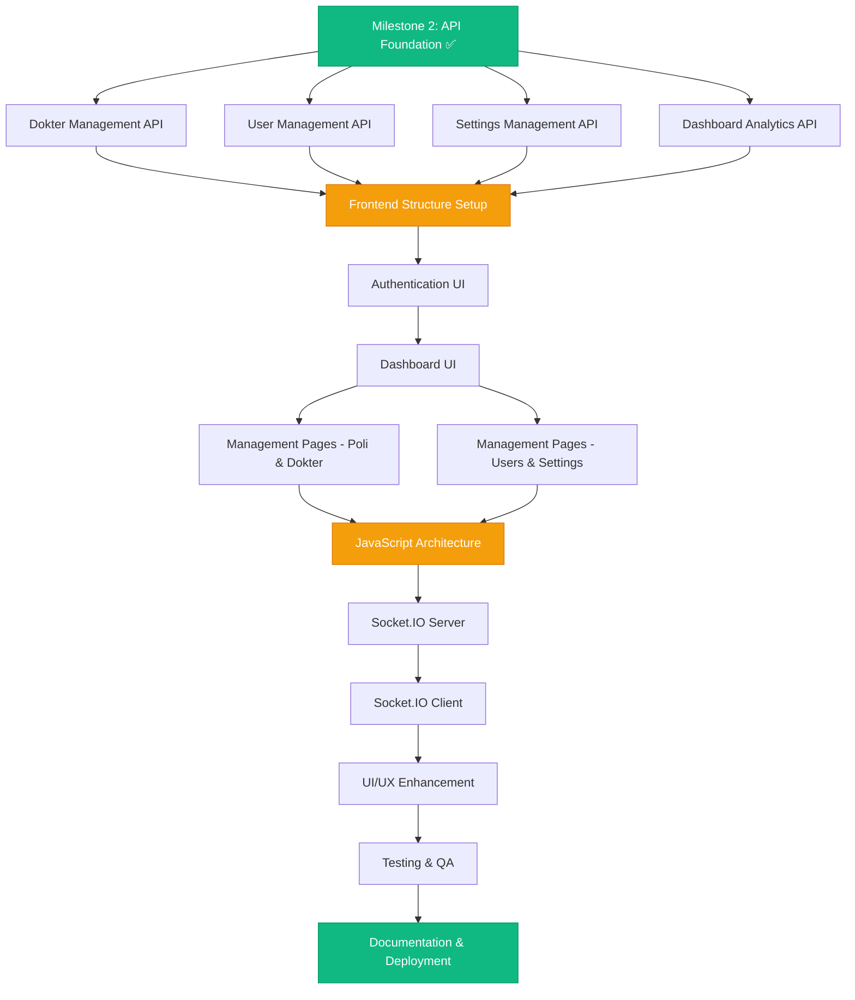
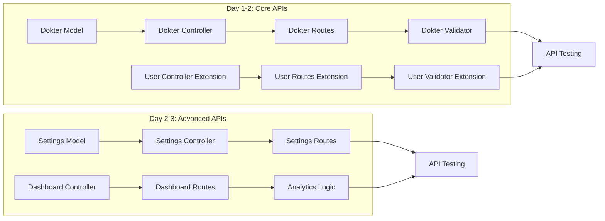
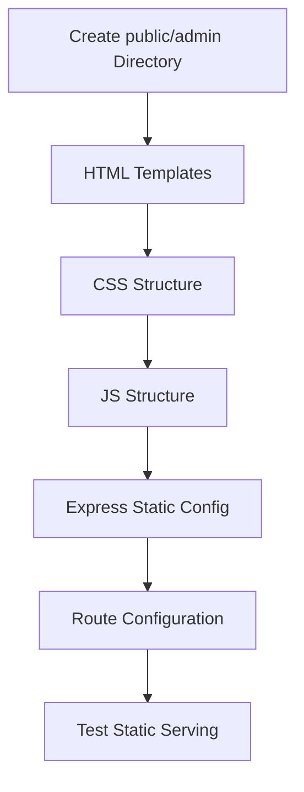
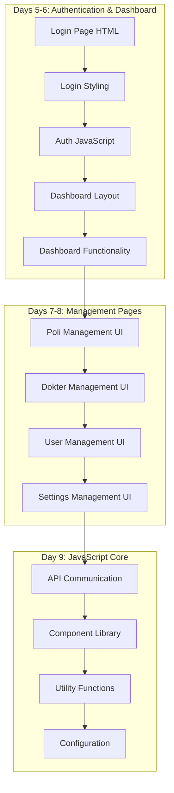
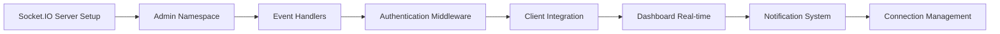
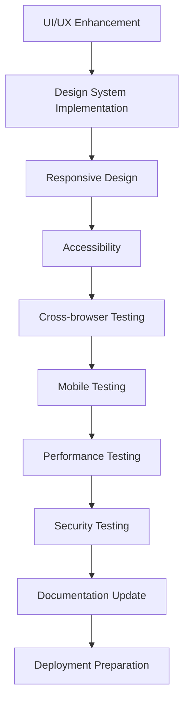
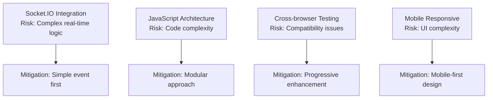

# Milestone 3: Panel Admin - Timeline & Dependencies

## 📅 Project Timeline Overview



```mermaid
gantt
    title Milestone 3: Panel Admin Development Timeline
    dateFormat  X
    axisFormat %d
    
    section Phase 1: Backend APIs
    Dokter Management API    :active, api1, 1, 2
    User Management API      :active, api2, 1, 2
    Settings Management API  :active, api3, 2, 3
    Dashboard Analytics API  :active, api4, 2, 3
    
    section Phase 2: Frontend Setup
    Directory Structure      :setup1, after api4, 1d
    Static Configuration     :setup2, after setup1, 1d
    
    section Phase 3: Frontend Core
    Authentication UI        :ui1, after setup2, 2d
    Dashboard UI            :ui2, after ui1, 2d
    Management Pages        :ui3, after ui2, 2d
    JavaScript Architecture :ui4, after ui3, 1d
    
    section Phase 4: Real-time
    Socket.IO Server        :rt1, after ui4, 1d
    Socket.IO Client        :rt2, after rt1, 1d
    
    section Phase 5: Polish
    UI/UX Enhancement       :polish1, after rt2, 1d
    Testing & QA           :polish2, after polish1, 1d
    Documentation          :polish3, after polish2, 1d
```

## 🔄 Task Dependencies Flow



## 📋 Phase-by-Phase Breakdown

### Phase 1: Backend API Completion (Days 1-3)



### Phase 2: Frontend Structure Setup (Day 4)



### Phase 3: Frontend Implementation (Days 5-9)



### Phase 4: Real-time Integration (Days 10-11)



### Phase 5: Polish & Testing (Days 12-13)



## 🎯 Critical Path Analysis

### Critical Path (Longest Duration):
```
Milestone 2 → Backend APIs → Frontend Setup → Authentication UI → Dashboard UI → Management Pages → JavaScript Architecture → Socket.IO → Testing → Documentation
```

**Total Duration**: 13 days

### Parallel Work Opportunities:

1. **Backend APIs (Days 1-3)**:
   - Dokter API & User API dapat dikerjakan parallel
   - Settings API & Dashboard API dapat dikerjakan parallel

2. **Frontend Pages (Days 7-8)**:
   - Management pages dapat dikembangkan parallel setelah base components ready

3. **Testing (Day 12)**:
   - Unit testing dapat dilakukan parallel dengan UI enhancement

## ⚡ Risk Mitigation Timeline

### High-Risk Tasks:


### Contingency Plans:
- **Backend API Delays**: Use mock APIs untuk continue frontend development
- **Real-time Issues**: Implement polling fallback
- **UI Complexity**: Simplify design, focus on functionality first
- **Testing Delays**: Prioritize critical path testing

## 📊 Resource Allocation

### Development Focus per Phase:
```
Phase 1 (25%): Backend Development
Phase 2 (8%):  Infrastructure Setup  
Phase 3 (40%): Frontend Development
Phase 4 (17%): Real-time Integration
Phase 5 (10%): Testing & Polish
```

### Skill Requirements:
- **Backend**: Node.js, Express, MySQL, Socket.IO
- **Frontend**: HTML, CSS, JavaScript (Vanilla), DOM manipulation
- **Integration**: REST APIs, WebSocket, Authentication
- **Testing**: Manual testing, Cross-browser, Mobile

## 🏁 Milestone Completion Criteria

### Definition of Done:
- [ ] All 15 tasks completed and approved
- [ ] All API endpoints functional and tested
- [ ] Frontend responsive and cross-browser compatible
- [ ] Real-time updates working
- [ ] Security requirements met
- [ ] Performance targets achieved
- [ ] Documentation complete

### Success Metrics:
- **Functionality**: 100% feature completion
- **Performance**: <2s page load, <500ms API response
- **Quality**: Zero critical bugs
- **Usability**: Admin can complete tasks in ≤3 clicks
- **Compatibility**: Works on Chrome, Firefox, Safari, Edge
- **Responsiveness**: Works on desktop, tablet, mobile

---

**Next Action**: Begin Task 1 - Backend API Dokter Management
**Project Status**: 🚀 Ready to Start
**Dependencies**: ✅ All satisfied (Milestone 2 complete)